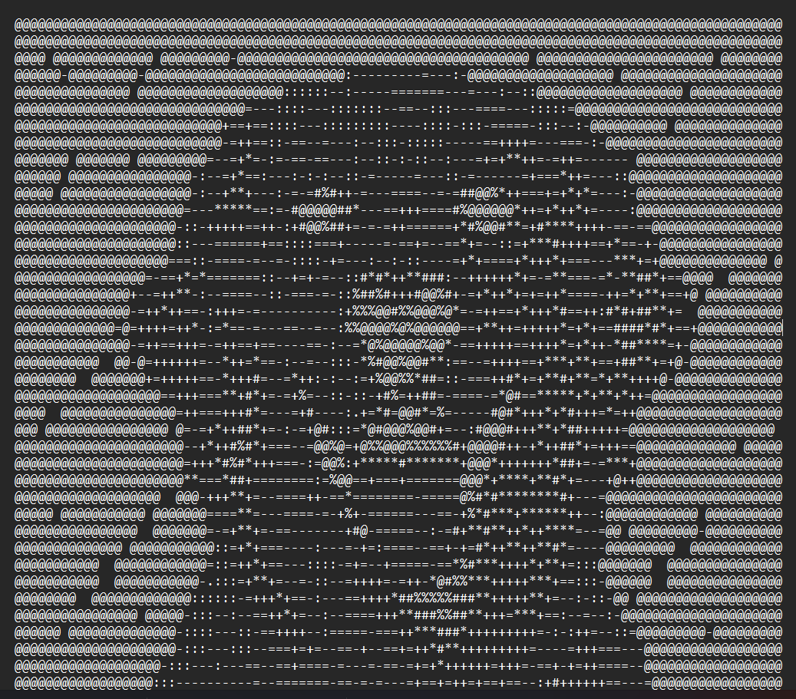

# ASCII Image Converter

A simple application that converts images into ASCII art using Python.

---

## Description

This project is a tool that transforms images into ASCII representations by mapping pixel brightness to characters.

The main objective was to practice working with image processing, file handling, and basic algorithm design. The application demonstrates how visual data can be represented using plain text.

---

## Preview



---

## Why I Built This

The project was created to improve programming skills, particularly:

* working with images in Python  
* understanding pixel manipulation  
* building simple algorithms for data transformation  
* handling files and user input  

---

## Features

* Convert images to ASCII art  
* Supports different image sizes  
* Adjustable output width  
* Brightness-to-character mapping  
* Option to save output to a `.txt` file  
* Works in terminal/console  

---

## Technologies

* Python  
* Pillow (PIL)  
* NumPy (optional)  

---

## Hot it works

* The program loads an image file (image.png)
* Resizes it while keeping proportions
* Converts it to grayscale
* Maps pixel brightness to ASCII characters
* Prints the ASCII art in the terminal
* Saves the result to:
 * ascii_image.txt

---

## How to Run

1. Clone the repository:

   ```bash
   git clone https://github.com/your-username/ascii-image-converter.git

2. Navigate to the project folder:

*cd ascii-image-converter

3.Install dependencies:

*pip install pillow

4. Make sure your image file is named:

*image.png

(or update the filename in main.py)

5. Run the script:

*python main.py
